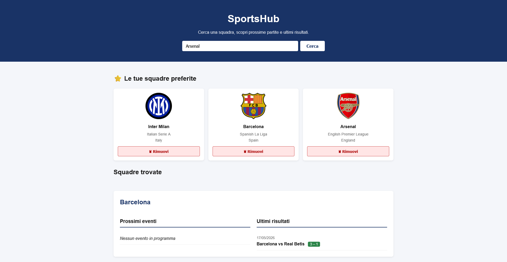

# 🏆 SportsHub

Web app front-end (HTML, CSS, JavaScript vanilla) per cercare squadre sportive, consultarne prossimi eventi e ultimi risultati, e salvarle nei preferiti con persistenza locale.

Progetto realizzato per la **Settimana 7** del corso FS0226IT, basato sull'API pubblica gratuita [TheSportsDB](https://www.thesportsdb.com/api.php).



## Indice

- [🏆 SportsHub](#-sportshub)
  - [Indice](#indice)
  - [Funzionalità](#funzionalità)
  - [Stack tecnico](#stack-tecnico)
  - [Struttura del progetto](#struttura-del-progetto)
  - [Come avviarlo](#come-avviarlo)
  - [API utilizzata](#api-utilizzata)
  - [Architettura del codice](#architettura-del-codice)
    - [Classi](#classi)
    - [Chiamate API](#chiamate-api)
    - [Stato e persistenza (localStorage)](#stato-e-persistenza-localstorage)
    - [Funzioni di render](#funzioni-di-render)
    - [Filtri per sport](#filtri-per-sport)
    - [Debounce sulla ricerca](#debounce-sulla-ricerca)
  - [Possibili sviluppi futuri](#possibili-sviluppi-futuri)

## Funzionalità

- 🔎 **Ricerca squadre** per nome (es. "Arsenal", "Lakers", "Real Madrid"), con debounce di 400ms così l'API non viene chiamata ad ogni carattere digitato.
- 🏷️ **Filtri per sport**: Tutti / Calcio / Basket / Football americano, applicati sia ai risultati di ricerca che alle squadre preferite.
- ⭐ **Preferiti persistenti**: le squadre salvate restano disponibili anche dopo il refresh della pagina (`localStorage`).
- 📅 **Dettagli squadra**: cliccando su "Aggiungi ai preferiti" oppure su una card già tra i preferiti, vengono mostrati i **prossimi eventi** e gli **ultimi risultati**, caricati in parallelo con `Promise.all`.
- 🎨 **Patch colorate per l'esito**: nelle ultime partite il punteggio è verde se la squadra ha vinto, giallo se ha pareggiato, rosso se ha perso.
- 💾 La squadra di cui stai consultando i dettagli resta visibile anche dopo un refresh della pagina.

## Stack tecnico

- HTML5 semantico
- CSS3 (Flexbox, Grid, animazioni, media query)
- JavaScript ES6+ (classi, async/await, Promise.all, fetch, localStorage)
- [Bootstrap 5](https://getbootstrap.com/) e [Bootstrap Icons](https://icons.getbootstrap.com/) via CDN (solo per componenti base: bottoni, spinner, icone)
- Nessuna build tool, nessun framework: è un progetto interamente client-side

## Struttura del progetto

```
├── index.html              # markup della pagina
├── assets/
│   ├── css/
│   │   └── style.css       # tutti gli stili custom
│   ├── script/
│   │   └── script.js       # logica dell'app (classi, API, render, eventi)
│   └── img/
│       └── risultato-desktop.png
└── README.md
```

## Come avviarlo

Non serve alcuna build: basta aprire `index.html` nel browser, oppure servirlo con un server statico (consigliato per evitare limitazioni di alcuni browser su `fetch` da `file://`):

```bash
npx serve .
# oppure, con l'estensione "Live Server" di VS Code: tasto destro su index.html > "Open with Live Server"
```

## API utilizzata

Tutte le chiamate puntano a **TheSportsDB v1**:

```
https://www.thesportsdb.com/api/v1/json/3/
```

Il `3` nel path è la API key pubblica di test fornita da TheSportsDB: gratuita, non richiede registrazione.

| Endpoint | Uso nel progetto |
|---|---|
| `searchteams.php?t={query}&s={sport}` | Ricerca squadre per nome, con filtro opzionale per sport |
| `eventsnext.php?id={idTeam}` | Prossimi eventi di una squadra |
| `eventslast.php?id={idTeam}` | Ultimi risultati di una squadra |

## Architettura del codice

Tutto il codice JS vive in `assets/script/script.js`, diviso per sezioni commentate: `=== Classi ===`, `=== API ===`, `=== Stato ===`, `=== Render ===`, `=== Eventi ===`.

### Classi

**`Squadra`** — mappa i dati di una squadra restituiti da `searchteams.php`:

```js
class Squadra {
  constructor(id, nome, logo, lega, paese, sport) { ... }
}
```

**`Evento`** — mappa una partita (prossima o passata) restituita da `eventsnext.php` / `eventslast.php`, con tre metodi:

- `getDataFormattata()` → converte la data in formato leggibile `it-IT` (es. `17/05/2026`), con fallback se la data non è valida.
- `getPunteggio()` → ritorna `"3 - 1"` se la partita è stata giocata, altrimenti `"VS"`.
- `getEsito(nomeSquadra)` → calcola se `nomeSquadra` ha vinto, perso o pareggiato confrontando i punteggi e verificando se gioca in casa o in trasferta. Ritorna `"vittoria"` | `"pareggio"` | `"sconfitta"` | `null` (partita non ancora giocata). Usato per colorare la patch del punteggio.

### Chiamate API

**`cercaSquadre(query, sport = "")`** — chiama `searchteams.php`, aggiungendo `&s={sport}` all'URL solo se è stato selezionato un filtro diverso da "Tutti". Mappa la risposta in un array di `Squadra`.

**`caricaDettagli(idTeam)`** — chiama **in parallelo** (`Promise.all`) `eventsnext.php` ed `eventslast.php` per lo stesso `idTeam`, poi mappa entrambe le risposte in array di `Evento`. Usata sia per i risultati di ricerca che per i preferiti.

### Stato e persistenza (localStorage)

| Variabile in memoria | Chiave in `localStorage` | Scopo |
|---|---|---|
| `preferiti` | `sportshub_preferiti` | Elenco delle squadre salvate (id, nome, logo, lega, paese, sport) |
| `squadraSelezionataId` | `sportshub_squadra_selezionata` | Id della squadra di cui sono aperti i dettagli, per mostrarli di nuovo dopo un refresh |
| `sportSelezionato` | *(non persistito)* | Filtro sport attivo: `""` (Tutti), `"Soccer"`, `"Basketball"`, `"American Football"` |

`caricaPreferiti()` / `salvaPreferiti()` leggono e scrivono l'elenco preferiti; `salvaSquadraSelezionata(id)` aggiorna sia la variabile che la chiave dedicata (la rimuove se `id` è `null`).

### Funzioni di render

- **`renderRisultati(squadre)`** — disegna la griglia "Squadre trovate": ogni card mostra logo, nome, lega, paese e il bottone "Aggiungi ai preferiti" (disabilitato e marcato "✓ Nei preferiti" se la squadra è già salvata). Al click: aggiunge ai preferiti **e** mostra subito i suoi dettagli.
- **`renderPreferiti()`** — disegna la griglia "Le tue squadre preferite", filtrata in base a `sportSelezionato`. Ogni card è cliccabile: il click mostra i dettagli della squadra; il bottone "Rimuovi" (con `stopPropagation` per non attivare anche il click della card) la elimina dai preferiti.
- **`mostraDettagliSquadra(squadra)`** — popola `#dettagli-squadra-content` (sotto il titolo "Squadre trovate") con prossimi eventi e ultimi risultati della squadra passata, caricati via `caricaDettagli`. Salva anche la selezione corrente per la persistenza al refresh.
- **`creaCardEvento(evento, nomeSquadra)`** — crea il DOM di una singola partita; se riceve `nomeSquadra`, calcola l'esito con `evento.getEsito()` e applica la classe CSS `punteggio-vittoria` / `punteggio-pareggio` / `punteggio-sconfitta` per colorare la patch.
- **`mostraCaricamento()` / `mostraErrore()` / `creaSpinner()` / `creaAlert()`** — helper di UI per stati di caricamento ed errore.

### Filtri per sport

I quattro bottoni `.btn-filtro` (Tutti / Calcio / Basket / Football) hanno un attributo `data-sport` con il valore esatto richiesto dall'API (`Soccer`, `Basketball`, `American Football`, vuoto per "Tutti"). Al click:

1. Aggiornano `sportSelezionato` e la classe `.active`.
2. Se i dettagli aperti appartengono a una squadra di un altro sport, vengono nascosti (così non resta visibile un dettaglio incoerente col filtro).
3. Ridisegnano i preferiti filtrati e, se c'è una ricerca attiva, la rilanciano con il nuovo filtro.

### Debounce sulla ricerca

```js
function debounce(fn, delay) {
  let timeoutId;
  return (...args) => {
    clearTimeout(timeoutId);
    timeoutId = setTimeout(() => fn(...args), delay);
  };
}
```

Il listener `input` sul campo di ricerca usa `debounce(eseguiRicerca, 400)`: ogni carattere digitato annulla il timer precedente e ne avvia uno nuovo, così la chiamata API parte solo 400ms dopo l'ultima pressione di un tasto. Premere **Enter** o cliccare **Cerca** lanciano invece la ricerca immediatamente, senza attendere il debounce.

## Possibili sviluppi futuri

- Migrare i preferiti già salvati prima dell'introduzione del campo `sport` (oggi compaiono solo nel filtro "Tutti").
- Gestione paginazione/scroll infinito se una ricerca restituisce molte squadre.
